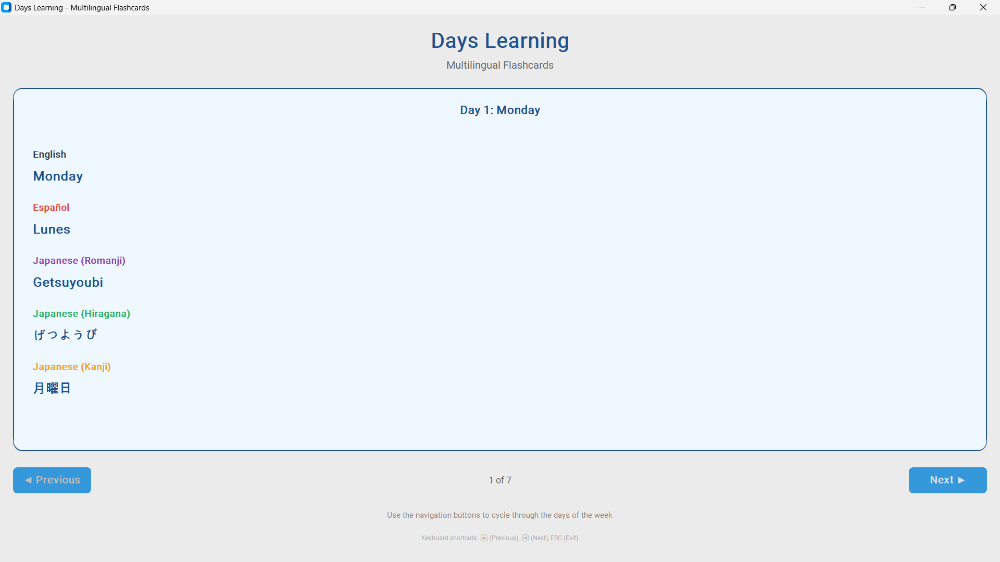

# Days Learning - Multilingual Flashcard Application

A modern Python GUI application for learning the days of the week in multiple languages. This interactive flashcard tool helps users memorize the names of the days in English, Spanish, and Japanese (Romanji, Hiragana, and Kanji) with a clean, user-friendly interface.

## Features

- Flashcards for each day of the week in five language representations.
- Intuitive navigation with "Previous" and "Next" buttons.
- Keyboard shortcuts for quick navigation (Left/Right arrows, ESC to exit).
- Responsive and visually appealing interface using [CustomTkinter](https://github.com/TomSchimansky/CustomTkinter).

## System Requirements

- Python 3.8 or higher
- Windows, macOS, or Linux

## Installation

1. **Clone the repository:**

   ```bash
   git clone <repository-url>
   cd days-learning
   ```

2. **(Optional) Create and activate a virtual environment:**

   ```bash
   python -m venv venv
   # On Windows:
   venv\Scripts\activate
   # On macOS/Linux:
   source venv/bin/activate
   ```

3. **Install dependencies:**
   ```bash
   pip install -r requirements.txt
   ```

## Usage

Run the application with:

```bash
python main.py
```

- Use the navigation buttons or keyboard arrows to cycle through the days.
- Press `ESC` to exit the application.

## Preview



## License

This project is provided for educational purposes. Please see the LICENSE file for more information if included.
